## 1. Fork Origin Repository
### A. Click Fork Button 

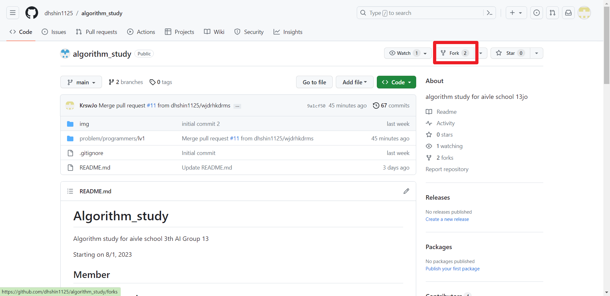

### B. Check Main Branch Only and Create Fork
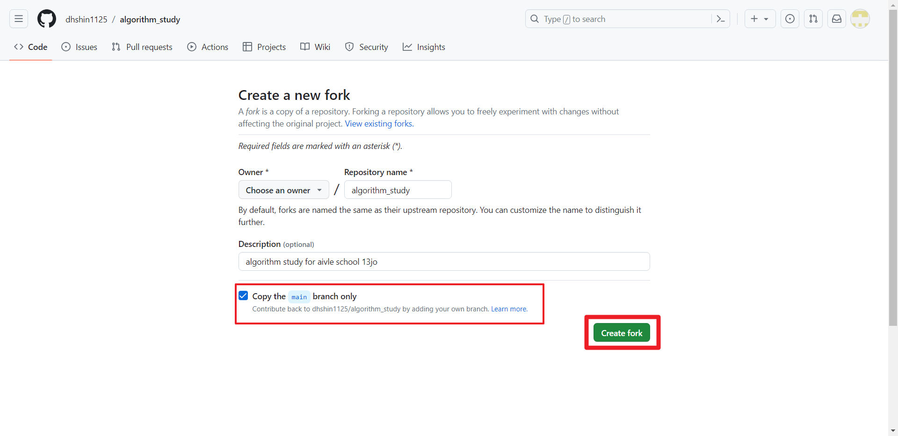

## 2. Clone the Forked Repository
### A. Click Code → Https → Copy Link
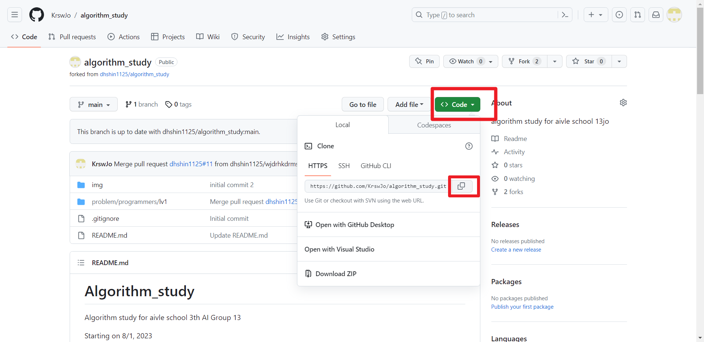

### B. Clone From your IDE

#### a. JetBrains IDE (Pycharm, IntelliJ, ETC)
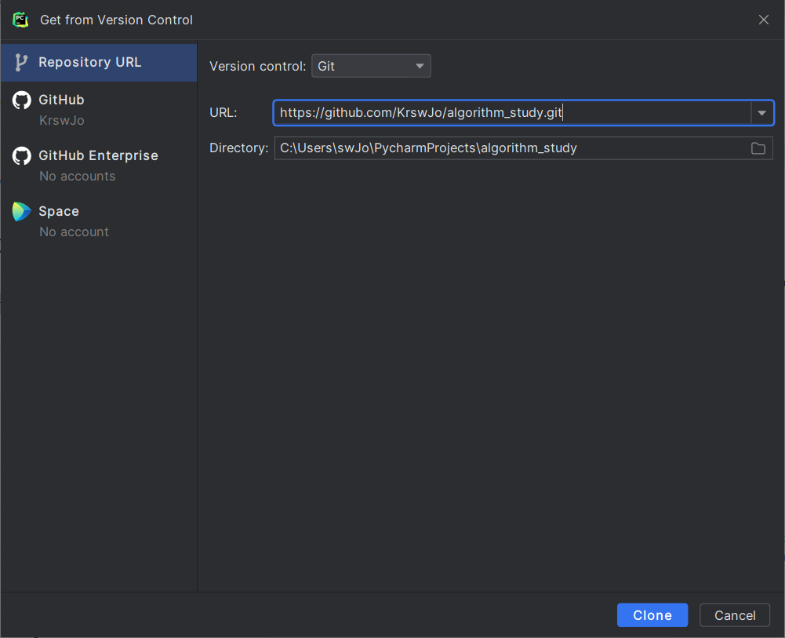

## 3. Commit your Assignment

### A. JetBrains IDE (Pycharm, IntelliJ, ETC)
#### a. Menu Bar → Git(VCS) → Commit
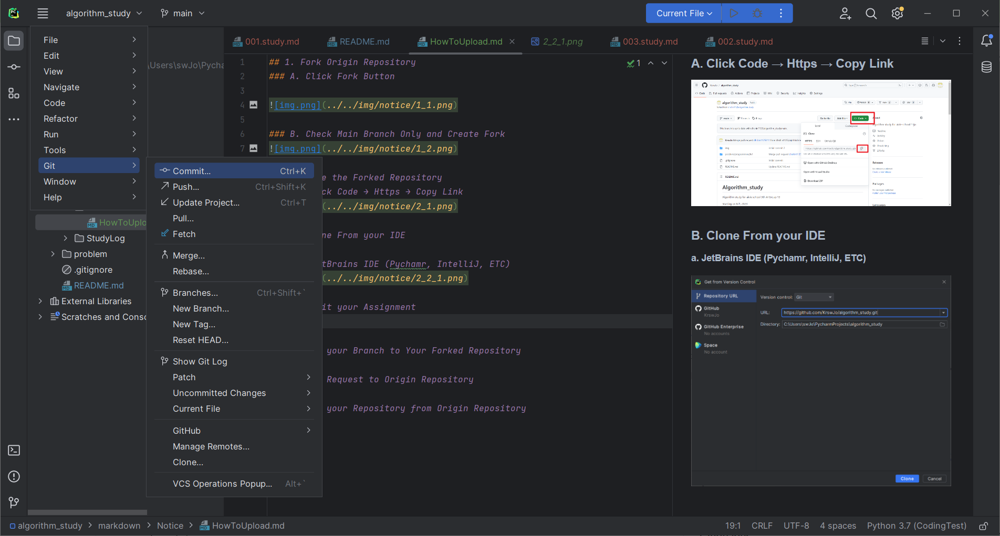
#### b. Add your file to commit → Click Commit Button
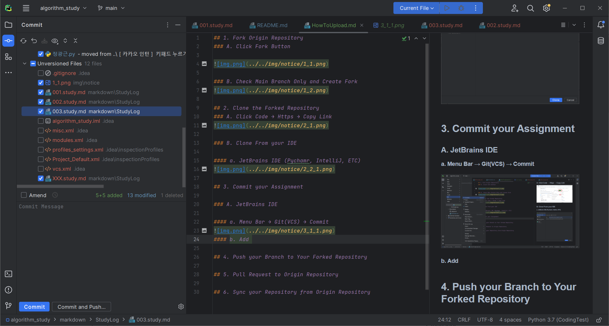

## 4. Push your Branch to Your Forked Repository

### A. JetBrains IDE (Pycharm, IntelliJ, ETC)
#### a. Menu Bar → Git(VCS) → Push
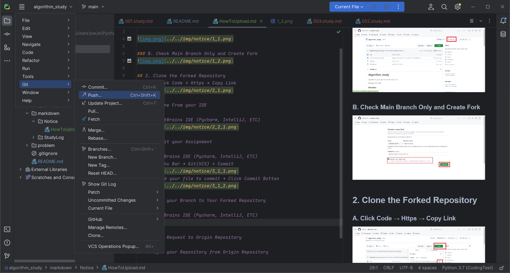

#### b. Check Target Remote Repository / Branch → Click Push 
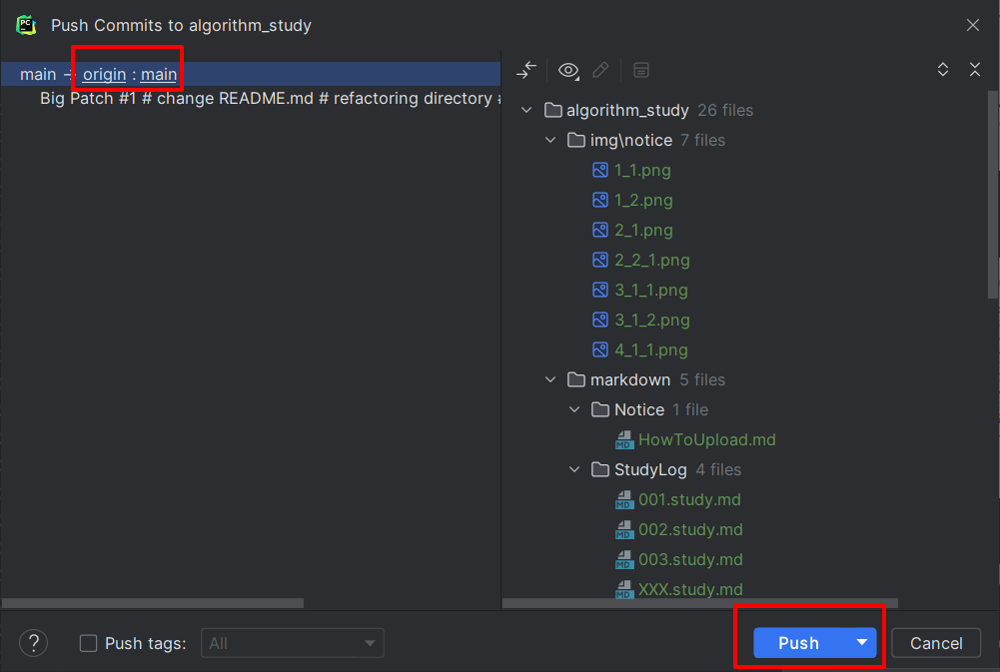

#### c. Complete !
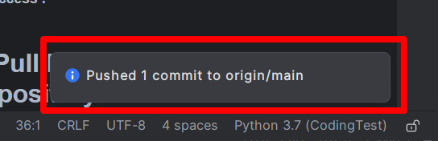

## 5. Pull Request to Origin Repository
### A. Go to your Forked Repository
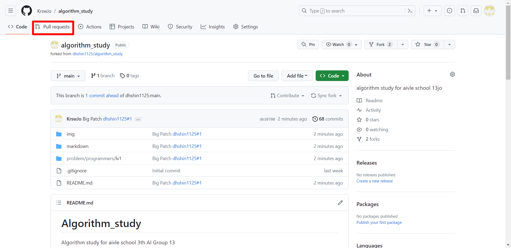

### B. Click New Pull Request
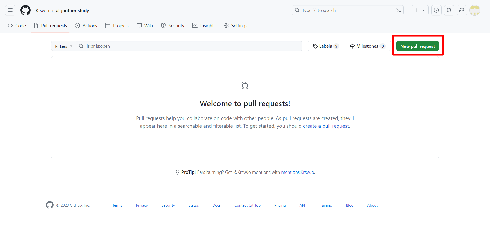

### C. Check Your Forked Repository / Origin Repository  → Create Pull Request
#### ※ Check "Able to merge. These branches can be automatically merged"
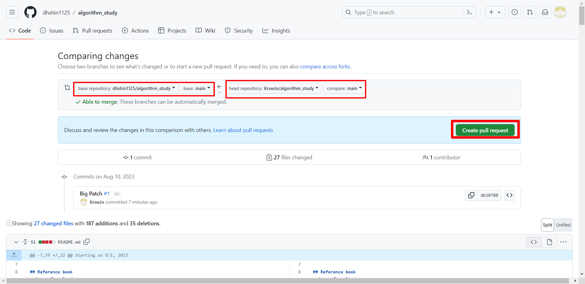

### D. Write Pull Request Form 
#### (1). Set Reviewers
#### (2). Set Assignees (KrswJo, dhshin1125)
#### (3). Set Labels (Submit or Help)
#### (4). Set Commit Title and Content
#### (5). Click Create Pull request
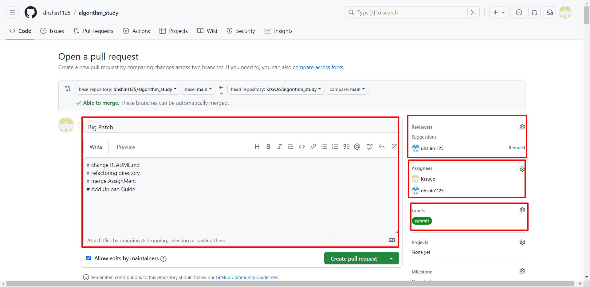

## 6. Sync your Repository from Origin Repository