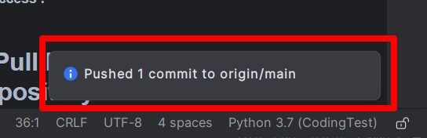

## 4. Push your Branch to Your Forked Repository

### A. JetBrains IDE (Pycharm, IntelliJ, ETC)
#### a. Menu Bar → Git(VCS) → Push

#### b. Check Target Remote Repository / Branch → Click Push 

#### c. Complete !
