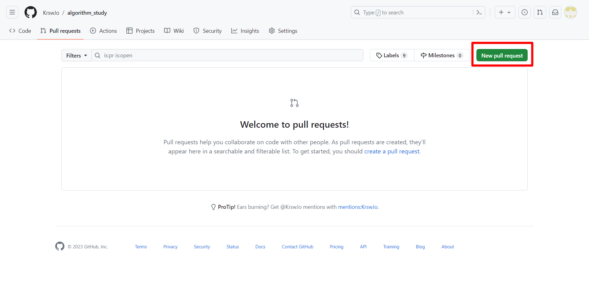
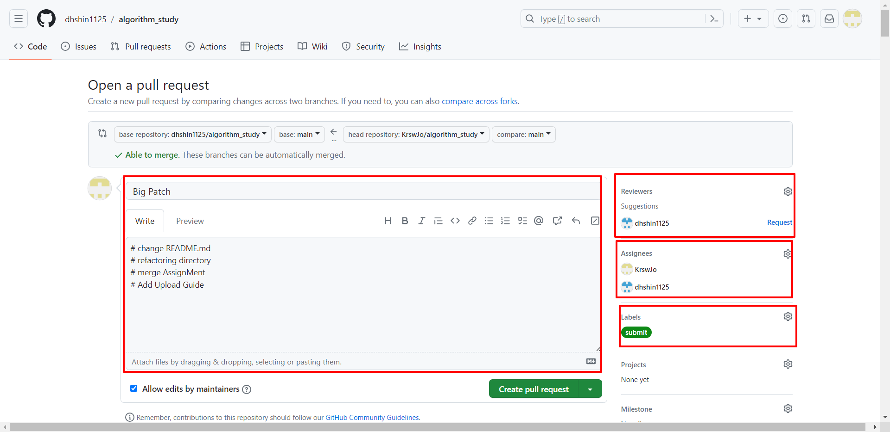

## 5. Pull Request to Origin Repository
### A. Go to your Forked Repository

### B. Click New Pull Request

### C. Check Your Forked Repository / Origin Repository  → Create Pull Request
#### ※ Check "Able to merge. These branches can be automatically merged"

### D. Write Pull Request Form 
#### a. Set Reviewers
#### b. Set Assignees (KrswJo, dhshin1125)
#### c. Set Labels (Submit or Help)
#### d. Set Commit Title and Content
#### e. Click Create Pull request

### E. Complete!
