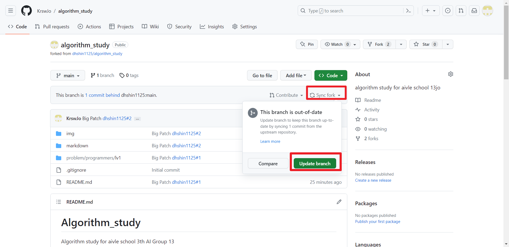
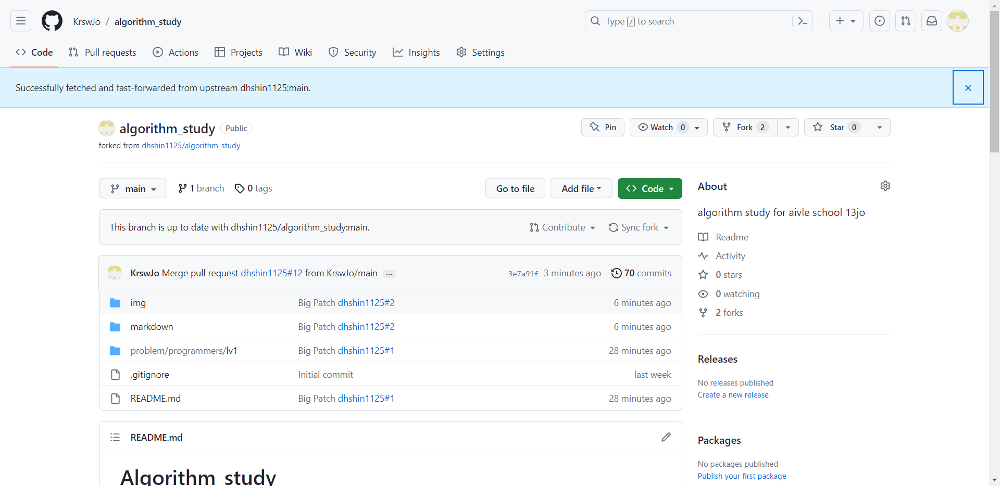
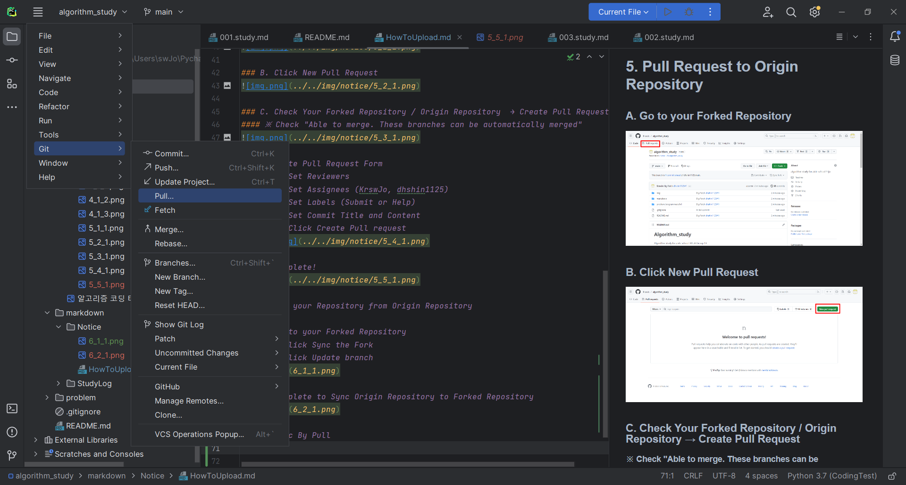
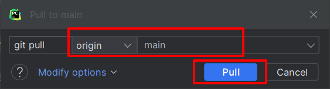

## 6. Sync your Repository from Origin Repository

### A. Go to your Forked Repository
#### a. Click Sync the Fork
#### b. Click Update branch

### B. Complete to Sync Origin Repository to Forked Repository

### C. Sync By Using Pull 

#### A. JetBrains IDE (Pycharm, IntelliJ, ETC)

##### a. Menu bar → Git(VCS) → Pull

##### b. Check Forked Remote / Branch → Click Pull
